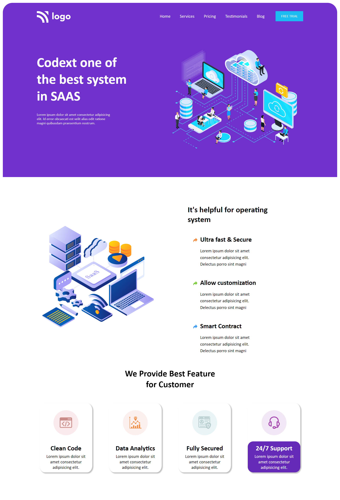

# Mohan Chindam

- This project's web page header is similar to the one I designed earlier.
- Used position, margin, flex, and other properties at the proper places to design the web page.
- Improved the intuitive understanding of the usage of elements.
- It took nearly three and half hours to complete this project.

- Below image shows the preview of the project:

I deployed the project on **Netlify**:
- You can preview the project here, [**SAAS Landing Page**](https://saas-landing-page-013.netlify.app/)

